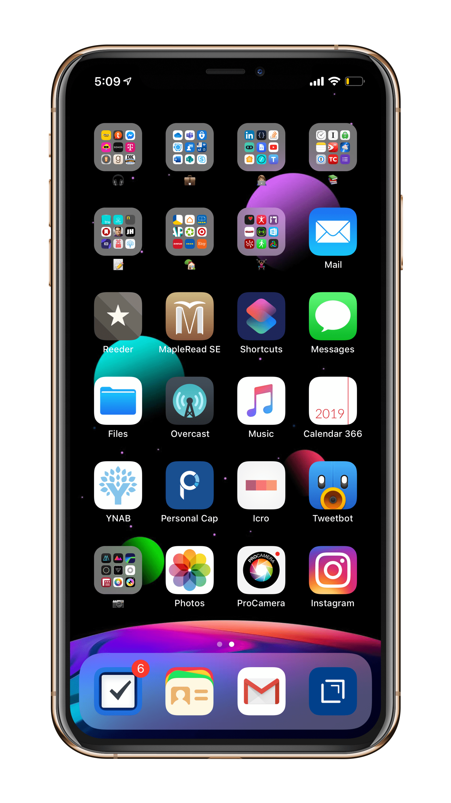
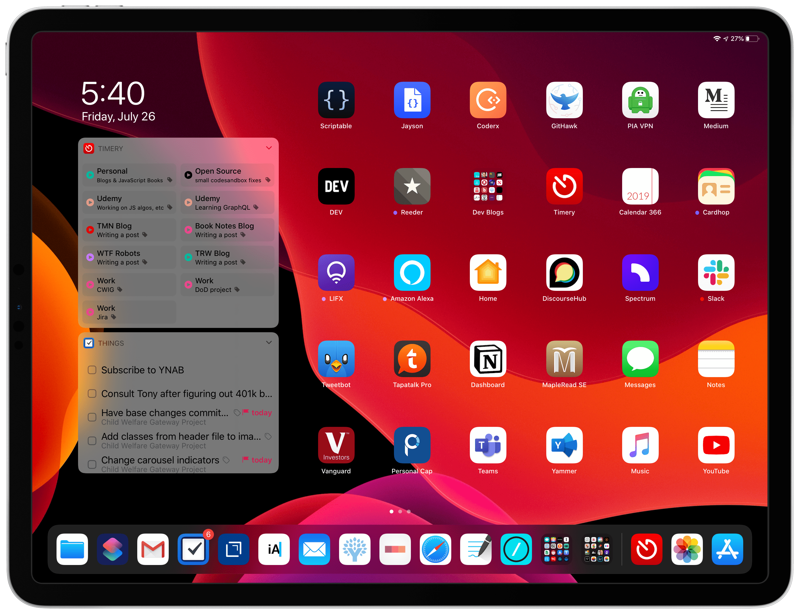
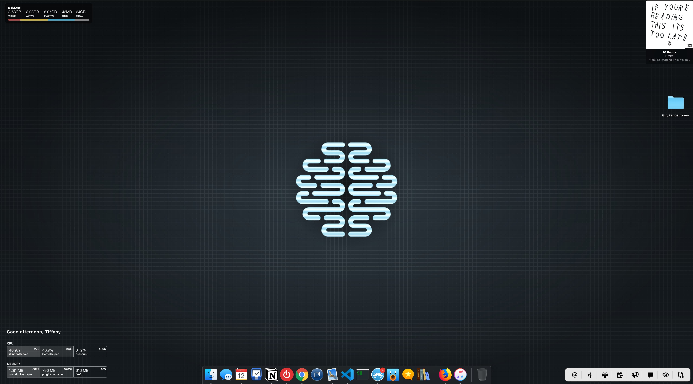
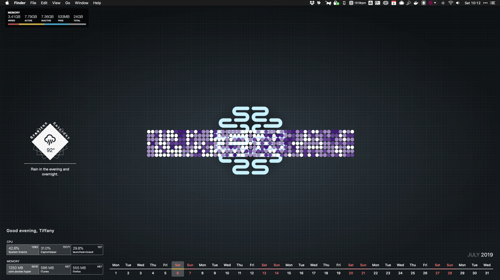

Derek Sivers set up a website called [nownownow.com](http://nownownow.com/about) to help people understand what a now page is, why you’d want one, and to [showcase other now pages](http://nownownow.com/). Maybe you should build one, too.

## What Am I Doing *Now*?

I [just got hired](https://tiffanywhite.dev/goal-completed/) as a junior dev so I am trying to get prepared for that and orientation, paperwork, and eventually moving apartments...again.

I am trying to get into better shape and am doing well at it.

I am working on three blogs: this one, Tiffany R. White Blog, my book review blog, [Book Notes by Tiffany](https://booknotesbytiffany.net)[^1], and my fun blog [That Mac Nerd](https://thatmacnerd.net/).

I've been trying to get back into [photography](https://www.eyeem.com/u/trwhite) as a creative outlet and excuse to get out of the house[^2].

---

## What's On My Pocket Computer?

We carry these things everywhere. Inspired by another `/now` page I am posting a screenshot of my iPhone and iPad, and also my iMac.

*I am going to be making more money than I ever have, so my home screen here is trying to start a budgeting habit. I also want to track more of my time and hours for work as I am working remotely.*

---

*Installed iPadOS. Digging it.*

---

## What's On My Mac?

*Cortex wallpaper. Pretty rad.*

*That GitHub contribution graph bruh*

---

I have *seriously* cut back on what I am doing because I really *have to* as I am working now. I'm glad because I would be headed for burnout again and that would be an awful way to start a new job.

What are you doing? I’m curious by nature. Share it with me on [Twitter](https://twitter.com/tiffanywhitedev) Or don’t. 🤷🏿

*Last Updated: 2019-07-27 21.34.29*

[^1]: Name inspired by Bill Gates [Gates Notes](https://www.gatesnotes.com/Books).
[^2]: I absolutely do not get enough time away from my desk. So I've gone on one photo walk and plan on doing more, at least once a week.
