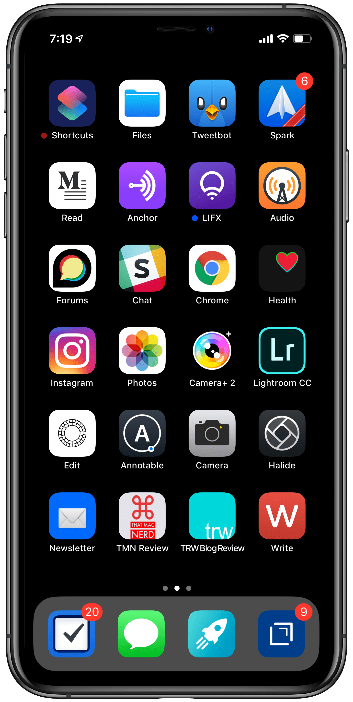
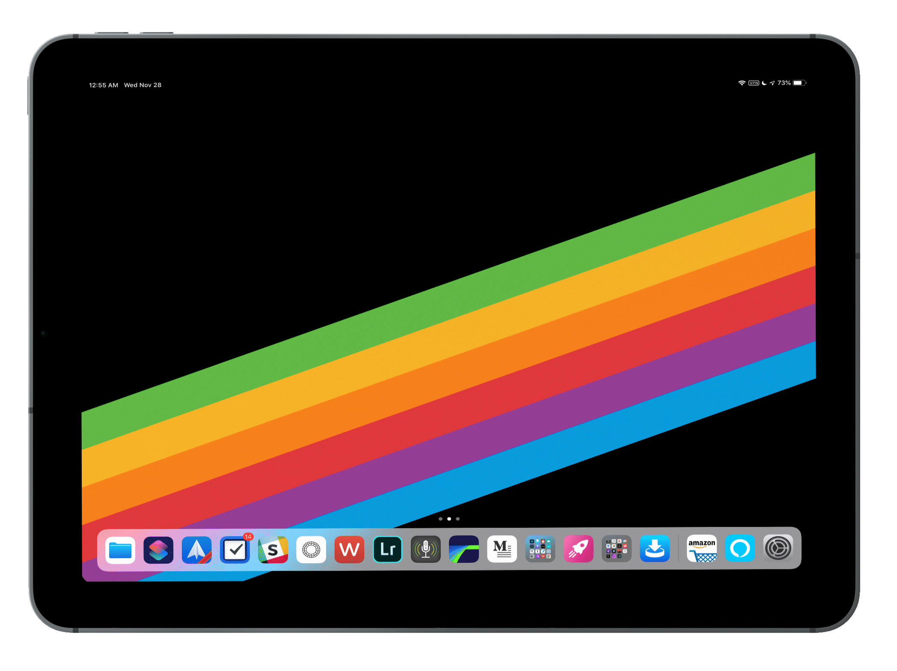
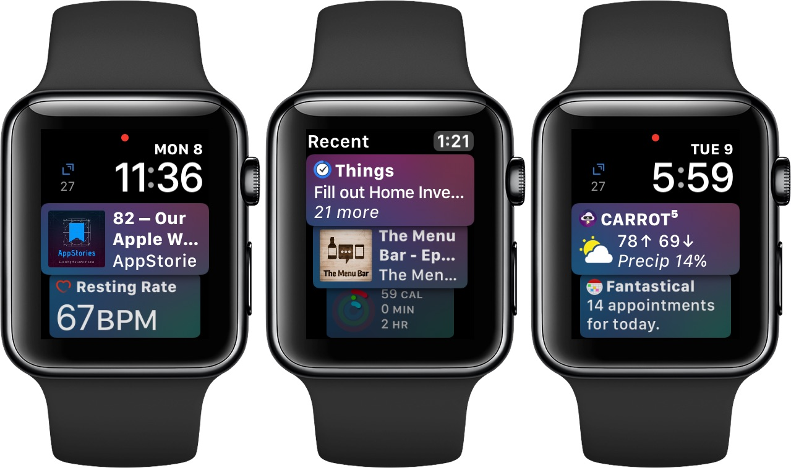
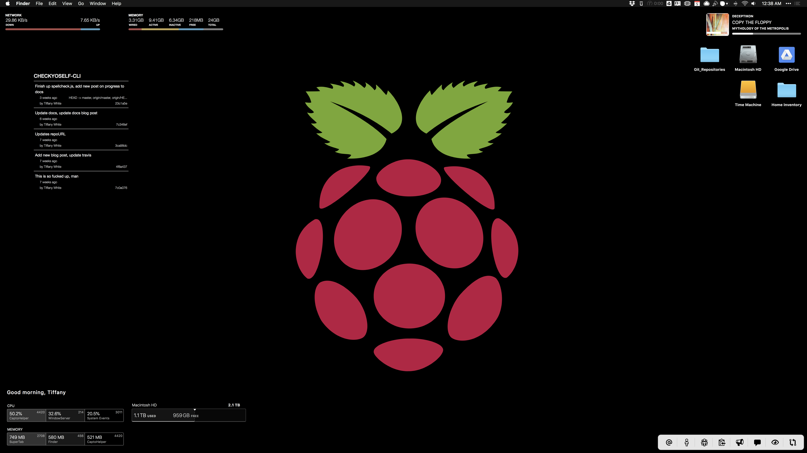
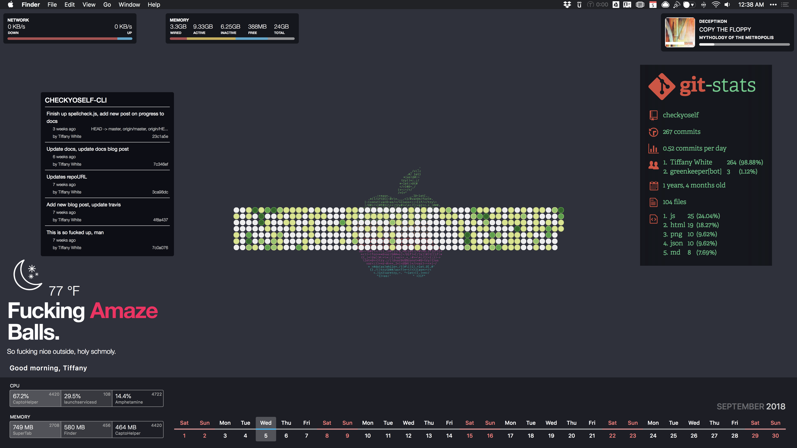

Derek Sivers set up a website called [nownownow.com](http://nownownow.com/about) to help people understand what a now page is, why you’d want one, and to [showcase other now pages](http://nownownow.com/). Maybe you should build one, too.

## What Am I Doing *Now*?

I live in Central PA and I am currently learning at a breakneck pace full-stack web development with [Wes Bos Courses](https://wesbos.com/courses/), [freeCodeCamp](https://www.freecodecamp.org/), and [Udemy](https://www.udemy.com/).

I am trying to get into better shape and am doing well at it.

I am working on two blogs:

This one, Tiffany R. White Blog and [That Mac Nerd](https://thatmacnerd.com/). I'm also doing [That Mac Nerd Podcast](https://anchor.fm/thatmacnerd) which has been really fun to do[^1].

I am building a markdown grammar checker called [Check Yo Self](https://github.com/twhite96/checkyoself) and [Check Yo Self CLI](https://checkyoself-cli.netlify.com/docs/doc1.html) which is just a simple command line utility to check the grammar and spelling of your markdown blog posts.

I also have a reusable component and a couple of React hooks in the works to open source...and...

I have also been invited to be an [an egghead.io instructor](https://egghead.io/instructors/tiffany-white). I have a few small lessons in the works so stay tuned.

---

## What's On My Pocket Computer?

We carry these things everywhere. Inspired by another `/now` page I am posting a screenshot of my iPhone and iPad, and also my iMac.

*My homescreen reflects what I am trying to do with technology: work, fun, and productivity*

---

*I got the new iPad Pro and have moved all my blog writing over to it, as well as podcast and video editing. I still need the Mac for some Jekyll-centric stuff though.*

---

*The new Siri watch face in watchOS 5 is a great addition, great enough to get me to switch from Modular. Loving it so far.*

---

## What's On My Mac?

*Übersicht is a pretty nifty alternative to GeekTool*

*Übersicht on the second monitor*

&nbsp;

---

This may seem like a lot and it is. I don't know if I'll get everything done, but if I get into more of a routine, I think it is doable.

What are you doing? I’m curious by nature. Share it with me on [Twitter](https://twitter.com/TiffanyW_412) Or don’t. 🤷🏿

*Last Updated: 2018-11-25 21.28.02*

[^1]: And more consistently. This one is pretty fun to do, hosted on Anchor for free. No real commitment.
