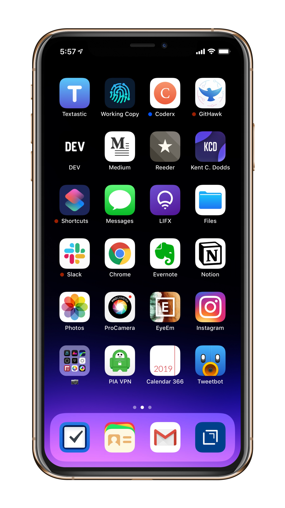
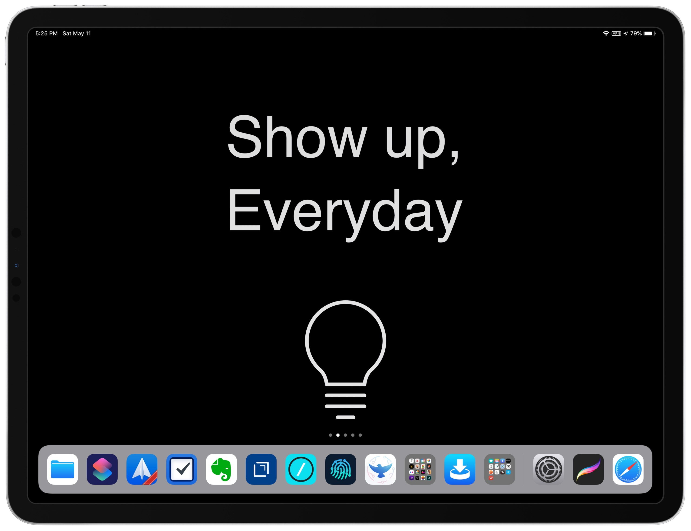

Derek Sivers set up a website called [nownownow.com](http://nownownow.com/about) to help people understand what a now page is, why you’d want one, and to [showcase other now pages](http://nownownow.com/). Maybe you should build one, too.

## What Am I Doing *Now*?

I live in Central PA and I am currently learning at a breakneck pace full-stack web development with [Wes Bos Courses](https://wesbos.com/courses/), [freeCodeCamp](https://www.freecodecamp.org/), and [Udemy](https://www.udemy.com/).

I am trying to get into better shape and am doing well at it.

I am working on two blogs: this one, Tiffany R. White Blog, and my book review blog, [Book Notes by Tiffany](https://booknotesbytiffany.net)[^1].

I am building a markdown grammar checker called [Check Yo Self](https://github.com/twhite96/checkyoself) and a few other projects.

I've been trying to get back into [photography](https://www.eyeem.com/u/trwhite) as a creative outlet and excuse to get out of the house[^2].

I also have a reusable component and a couple of React hooks in the works to open source...and...

I have also been invited to be an [an egghead.io instructor](https://egghead.io/instructors/tiffany-white). I have a few small lessons in the works so stay tuned.

---

## What's On My Pocket Computer?

We carry these things everywhere. Inspired by another `/now` page I am posting a screenshot of my iPhone and iPad, and also my iMac.

*Getting back into photography as a sort of stress reliever; I go for walks to look for something to shoot.*

---

*You almost literally have to jump through hoops in order to get any writing done on this, especially for a blog like this. But that is what I am going to try, starting with [Drafts](https://getdrafts.com/).*

---

*Switched back to my old face. I don't know why, I just like it better for some reason.*

---

## What's On My Mac?

*Übersicht is a pretty nifty alternative to GeekTool*

*Übersicht on the second monitor*

---

This may seem like a lot and it is. I don't know if I'll get everything done, but if I get into more of a routine, I think it is doable.

What are you doing? I’m curious by nature. Share it with me on [Twitter](https://twitter.com/tiffanywhitedev) Or don’t. 🤷🏿

*Last Updated: 2019-05-10 06.44.55*

[^1]: Name inspired by Bill Gates [Gates Notes](https://www.gatesnotes.com/Books).
[^2]: I absolutely do not get enough time away from my desk. So I've gone on one photo walk and plan on doing more, at least once a week.
