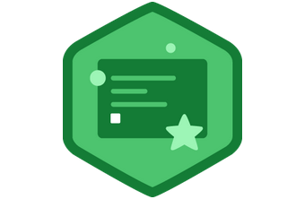

What I learned…errr last night was about using multiple strings with formatters in Java. For instance:


```java
String name = “Tiffany”;
String age = 30;

console.printf(“My name is %s and I am %s years old.”, name, age);
```

This is sort of like when I was doing Learn Python the Hard Way only the syntax is different and more verbose.

I learned how to get information into the console by way of prompting the user. So you have the console object and the method readLine to say something like:


```java
console.readLine(“What is your name?”);
```

This was interesting, getting to learn these new methods for a new language. Also knowing the Java is compiled and how to run the compile command with:


`javac`


I learned more about integers and getting an integer from a string. Whereas in JavaScript you’d use:

`parseInt`

in Java you have this long string:

`Integer.parseInt`


Building things and adding conditions was interesting as well. Here is a little snippet of the app we built in Java:

```java
String name = console.readLine("Enter a name: ");
String adjective = console.readLine("Enter an adjective: ");
String noun;
boolean isInvalidWord;
do {
    noun = console.readLine("Enter a noun: ");
    isInvalidWord = (noun.equalsIgnoreCase("dork") ||
                     noun.equalsIgnoreCase("jerk"));
    if (isInvalidWord) {
    console.printf("That language is not allowed. Try again. \n\n");
  }
} while(isInvalidWord);
```

To be honest, Java isn’t really too bad. I don’t like the verbosity. For instance in JavaScript you can call a method:

`noun.toLowerCase()`


instead of what we’ve got here in Java. Java is a little better in that the .equalsIgnoreCase makes things simpler so I could call it on any object and the case would be ignored completely. But it just <strong>looks</strong> cleaner.

So that was my experience fo Java Beginner Basic Course on Treehouse. I plan on diving deeper as the semester grinds on. For now, it’s learning RegEx and then back to JavaScript as I want to start thinking about building my app.
