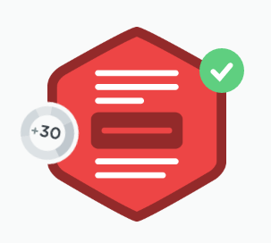

I only did one jQuery class today as I had a lot to get done otherwise, but we went over documentation (which I never use the browser for because <a href="https://kapeli.com/dash">Dash</a>) and preparing your prototype with comments, looking at your HTML file to see what you need to animate.

We went over manipulating the DOM (more on that in a moment) and Traversing the DOM and Event Handlers.

So you can manipulate the DOM with the `.hide()` method as well as the

```js
$(this).show()
```

. But we also added a button to the DOM in the HTML with this

```js
$(".spoiler").append("<button></button>Reveal Spoiler!</button>");
```

Also we went over event handlers. So now that we have the button made in our HTML you can add a

```js
$("button").click(function(){});
```

with passing an anonymous function in order to do something when the button we made is pressed.

<h2>$(this)</h2>

So in the code block with the button selector with the:
```js
.click(function() {});
```
you can <strong>do</strong> nifty things. So inside this code block we used

```js
$(this).show();
$(this).remove();
```

I hadn’t really gotten my head around `$(this)` until he explained that since we had two

```html
<span>
```
elements under the

```html
<div class= "spoiler"</div>
```

we needed to specify which button the

```js
$(this).show();
```

and

```js
$(this).remove();
```

when clicked. So I found that

`(this)`

is magical. So when I click on the first spoiler button, this knows what to do with it. It knows I’m not clicking the second spoiler button. It knows to hide remove the second one when I am clicking the first. Cool stuff.

It was a pretty easy lesson since I have gone over this on Codecademy and Free Code Camp. But refresher is great for reinforcement.
