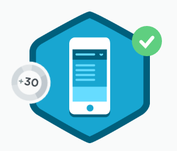

We went over more of the same but learned some new methods and event handlers.

We learned about GET methods like

`.prop()`

which manipulates the DOM to get the property value of the first element in the set.

We learned about the
`.change()`

event handler with an anonymous function that we used to change the function of the dropdown menu. Before we had a Go button but what good is that? You would select the dropdown and the link to say, an FAQ, and then press "Go". Well what about just <strong>going</strong> to that page when you touch or click on the dropdown menu link for that page? That is what we did by changing the whole behavior of the dropdown, and eliminating the appended Go button. Here is the code:


```js
$select.change(function() {
 //Go to select's locaiton
 window.location = $select.val();
 ```

The
`.val()`

gets the select input without passing any arguments. Which is just clicking on a link that we specified in the HTML and the class we referenced in the jQuery that holds that link.

jQuery isn’t at all bad. And I have two more things to go to complete that part of the Front End Web Dev Track.
