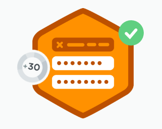

Here we just iterated on what we learned previously with:

`.prop() .hide() .show() .val()`

We learned two new methods,

`.focus()`

and

`.keyup()`

in relation to making it so the tooltips showed up when we clicked in the form’s password box, the tool tip being “password needs to be greater than 8 characters”. Once the 8 characters were put in, the tool tip disappeared.

The code looked something like this:


```js
//Problem: Hints are shown even when form is valid
//Solution: Hide and show them at appropriate times
var $password = $("#password");
var $confirmPassword = $("#confirm_password");

//Hide hints
$("form span").hide();

function isPasswordValid() {
 return $password.val().length < 8;
}

function arePasswordsMatching() {
 return $password.val() === $confirmPassword.val();
}

function canSubmit() {
 return isPasswordValid() && arePasswordsMatching() && isUsernamePresent();
}

function passwordEvent(){
 //Find out if password is valid
 if(isPasswordValid()) {
 //Hide hint if valid
 $password.next().hide();
 } else {
 //else show hint
 $password.next().show();
 }
}
```
We practiced DRY programming by wrapping our resued methods, variables, etc in functions.
