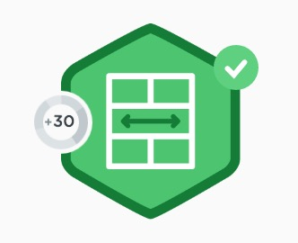

<h2>The DOM</h2>

So today was basically going over HTML tables. Easy. Then we went through MDN JavaScript Web API to learn about the DOM.

Went inside Chrome Dev Tools to look at what the

`window.document`

was.

So the window is the <strong>entire window opened in your browser</strong>. You can get information from the window, call methods on it and functions. Usually you don’t write

`window.document`

to access the document, (which is part of the DOM or <em>Document Object Model</em>).

The DOM is basically the HTML document, arranged in a tree, with nodes that you can manipulate with JavaScript and jQuery.

<h2>HTML Tables</h2>

Self-explanatory really. So you have a few


```html
<table></table>
```

```html
<table></table>
```


```html
<table></table>
```


tags under which you can have this:


```html
<table>

  <thead>

   <tbody>

   <tfoot>

     <tr>

      <td></td>

     </tr>

   </tbody>

  </tfoot>

 </thead>

</table>

```

