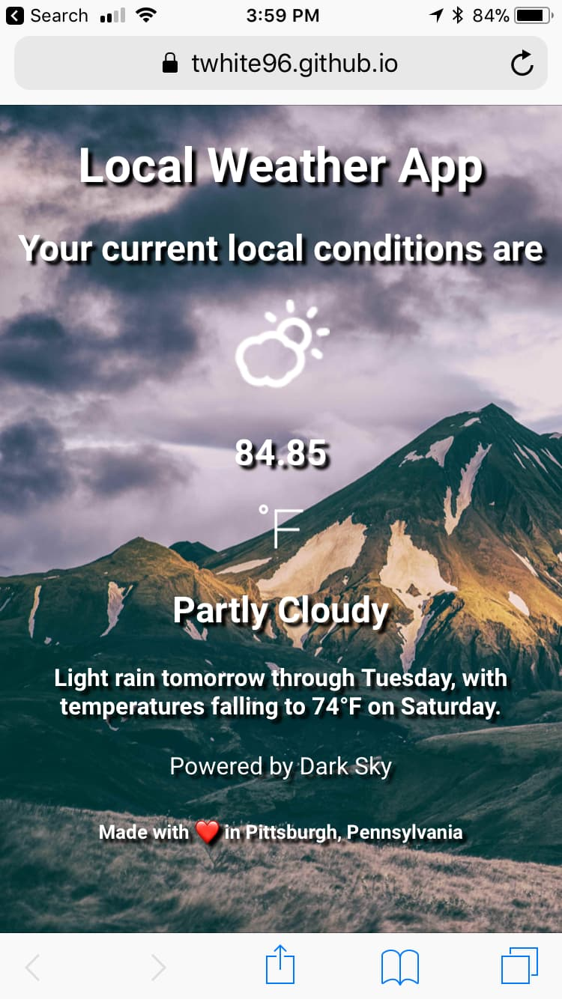

Yesterday [^1] I found myself in a situation where the background image in my freeCodeCamp Weather App on mobile was cut off at the bottom. Needed some background image hacks in css to fix it.

## For context

My code for switching up the background depending on your weather conditions is as follows:

```javascript
const iconMap = {
  "clear-day": "url(https://res.cloudinary.com/twhiteblog/image/upload/v1534887427/Weather%20App%20Images/sunny.jpg)",
  "partly-cloudy-night": "url(https://res.cloudinary.com/twhiteblog/image/upload/v1534887409/Weather%20App%20Imafineas-anton-136459_copy.jpg)",
  "clear-night": "url(https://res.cloudinary.com/twhiteblog/image/upload/v1534887421/Weather%20App%20Images/sam-mcjunkin-38078.jpg)",
  "partly-cloudy-day": "url(https://res.cloudinary.com/twhiteblog/image/upload/v1534887413/Weather%20App%20Images/jeff-nafura-294909.",
  "cloudy": "url(https://res.cloudinary.com/twhiteblog/image/upload/v1534887428/Weather%20App%20Images/jonatan-pie-260835.jpg)",
  "rain": "url(https://res.cloudinary.com/twhiteblog/image/upload/v1534887410/Weather%20App%20Images/3opt_rain.jpg)",
  "sleet": "url(https://res.cloudinary.com/twhiteblog/image/upload/v1534887412/Weather%20App%20Images/jonatan-pie-190398.jpg)",
  "snow": "url(https://res.cloudinary.com/twhiteblog/image/upload/v1534887417/Weather%20App%20Images/snow.jpg)",
  "wind": "url(https://res.cloudinary.com/twhiteblog/image/upload/v1534887424/Weather%20App%20Images/jon-flobrant-2845.jpg)",
  "fog": "url(https://res.cloudinary.com/twhiteblog/image/upload/v1534887392/Weather%20App%20Images/elaine-li-416.jpg)"

 (function() {
   $("body").css("background-image", iconMap[currentIcon]);
 })();

```

This bug had been bothering me for a week or so. I searched on Stack Overflow for an appropriate solution and found that I could use a `div` wrapper and add:

```css
body {
   background-size: cover;
   background-repeat: no-repeat;
}
```

I added the wrapper but nothing happened.

I also already had my main content wrapped in a `div`:

```html
<div class="wrapper">
  <div class="col-md-12">
    <header>
      <h1 class="h1-title">Local Weather App </h1>
      <h3></h3>
    </header>
  </div>
</div>

```
## Object-fit, etc

You can usually `object-fit` on an image with the properties: `fill`, `cover`, `contain`, `scale-down`, or `none`:


*fill*


*cover*


*contain*


*scale-down*


*none*

I tried `object-fit: cover` on the body. Didn’t work. Same with `contain`, `scale-down`, and `fill`.

I searched some more and found the answer on a Treehouse forum.

```css
html {
   min-height: 100%;
}
```
I tried `height: 100%` on the `body` but that didn’t work either.

Since the `html` element is actually at the root of the `document` and `body` descends from the `html` element, applying the global style to the `html` element actually makes sense.

Also, because I am specifying a minimum height that happens to be a percentage, it makes it responsive because I am not specifying a fixed size in the viewport.

Now, I have a mobile app that looks like this:



Still, I need to fix the loading issue. Thats for another day.

You can find the weather app at [freeCodeCamp Weather App](https://fcc-weather-app96.netlify.com).

[^1]: And for several days before that actually.
