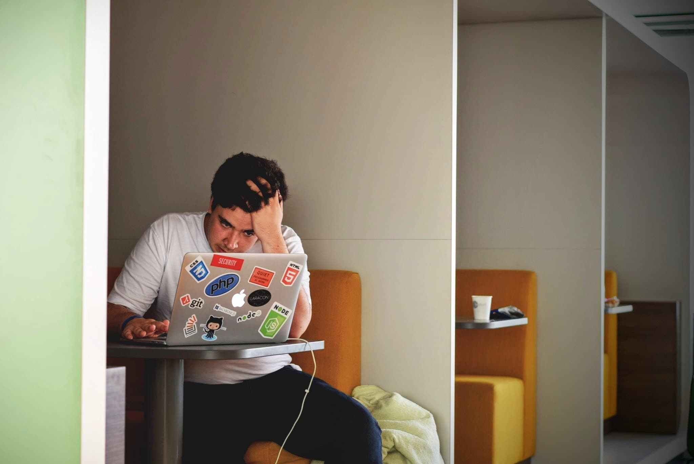

> This post is a recycled newsletter I just recently released but with extra content.

## *From the newsletter*:

Last year's hell is this year's hangover, or so it seems.

There are periods of intense studying, thinking about problems, filling up my freeCodeCamp consecutive days streak in dark green squares.

Then there are...*other days*. Days where everything is taxing and sleep is your best friend.

I have a lot of those days lately. And the issue?

***I have been at this a long time with minimal success***.

This is really my fault; I literally have no one to blame but *myself*.

I've spent an egregious amount of time on video tutorials and *am just now finding out* I learn best by *doing*. Trying to figure out how to get a `Search` component working on my site was *hard* but *necessary*.

Years wasted. And I sat around feeling sorry for myself; feeling that twinge of envy every time someone got a new job as a junior. I knew, know, I am not doing enough, wasn't doing enough. Depression and burnout will do that to you.

Spending years on *go* is difficult to sustain. You *will* crash. And I did. Several times. And went about doing things the same way again.

## F*ck Complacency.

I really had to get real with myself.

1. What do I *really* want?
2. What am I willing to do to get it?
3. What safeguards can I put in place so that this type of long burnout never happens again?
4. How hard am I willing to try by putting myself out there and putting in the work?

I really *want* to be a developer.

I am willing to put in the hours, even when I don't want to, to get it.

I need to listen to my body and take the weekend for self-care. *Self-care* is a loaded buzzword but I didn't do it for many years and now I am stuck, 4 years programming with nothing to show for it. I journal. A lot. I see a professional. I have a [photography](https://www.eyeem.com/u/trwhite) [hobby](https://www.flickr.com/photos/sydmalicious/) I really enjoy. I have this dope robot car I am building. I do this on the weekends. I go out with friends and have friends over. I won't get into too many details but I really *missed* this while I was in Pittsburgh. And if I ever move from here again, I really need to make sure I actually *know* some people in the new area.

*Robots are pretty cool*

I am willing to anything. And this is where other's success comes in.

Seeing the folks over the weekend sharing their freeCodeCamp JavaScript and Data Structures & Algorithms certificates made a little angry, not at them, but myself. I have been a camper since the beginning, making an account when they were still using Ruby and other course sites to help you learn. I have *zero* certificates. *None*. I am super ashamed of this.

https://www.instagram.com/p/BxqLDT_j0OS/

One of the ways I am motivating myself is having this random certificate frame I picked up from the Dollar Tree. It is going up on the wall in front of my desk as a reminder of what I need to do to fill it with a freeCodeCamp certificate.

## Setting up a study plan

I have a couple Google Sheets I setup to help me study.

If you want to use them, you can find them at the following places:

[Job Ready: Study Plan for Front-End Employment](https://docs.google.com/spreadsheets/d/1eBStSPDP8jXpPQvmKI35ogaSms864WRKFScRIc0GoKw/edit?usp=sharing)

[CS Study Plans](https://docs.google.com/spreadsheets/d/1cgyOyqpmtCtCDxYmgRSzDoTXO9L9PZLGVLoruY-AmrI/edit?usp=sharing)

## Addendum

I can't stress enough how important it is to have support systems, and good ones, either virtually or in person, *especially* in person, around you.

I didn't have any of this in Pittsburgh and it is taking some time for me to get out of recluse mode back here in my hometown. As I said above, I am trying to take my health, mental or otherwise more seriously. It doesn't help that my birthday was earlier this month, and none of use are getting any younger. I can't afford to neglect my health any longer. I did that for far to long and it cost me, big time, in the summer of last year.

I have friends here I've known for 20 some odd years. We hang out. Whenever I am depressed or burned out, they are always there for me and if they are having a hard time, I try to be there for them.

It's the weekend right now, early morning. I am about to just publish this and head upstairs. I am thankful for my friends and family because without them this past year I don't think I'd have made it.
